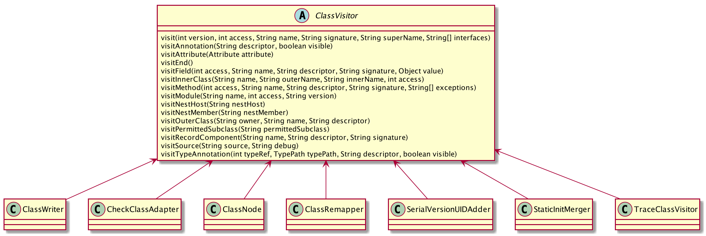
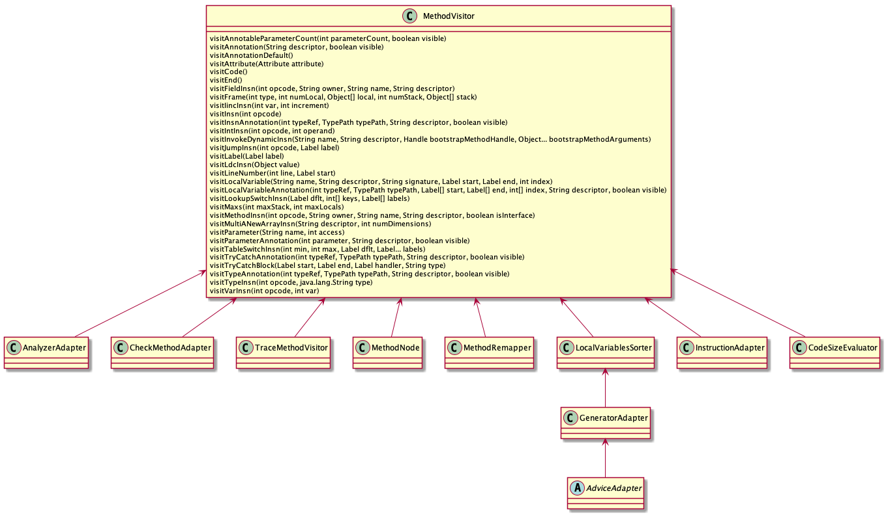
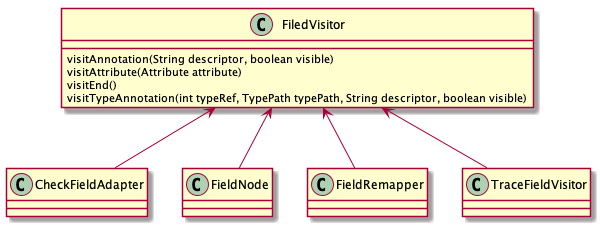
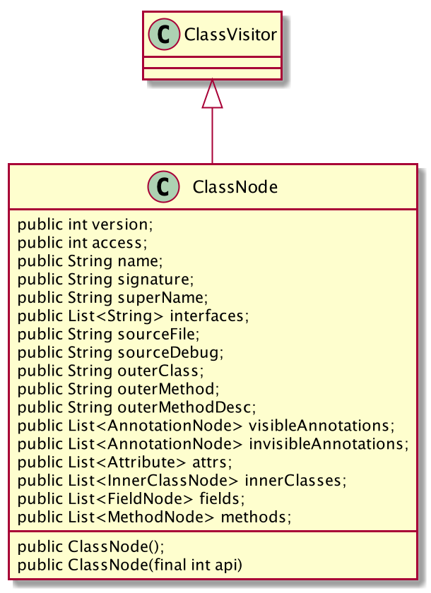
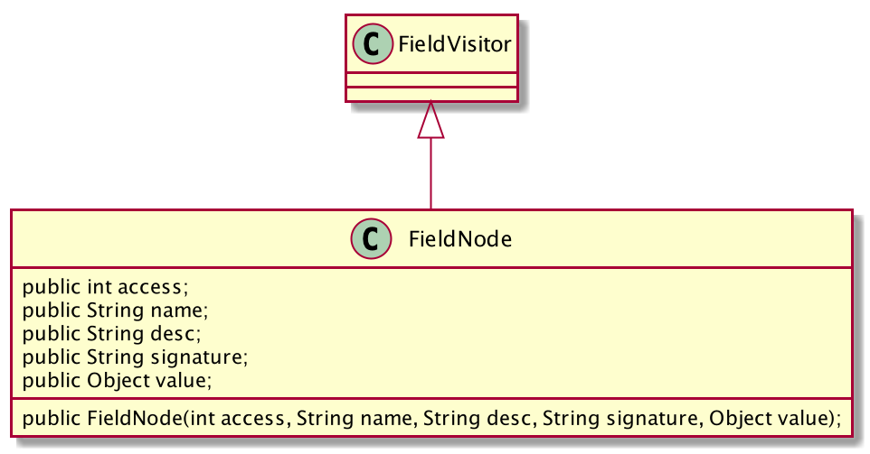
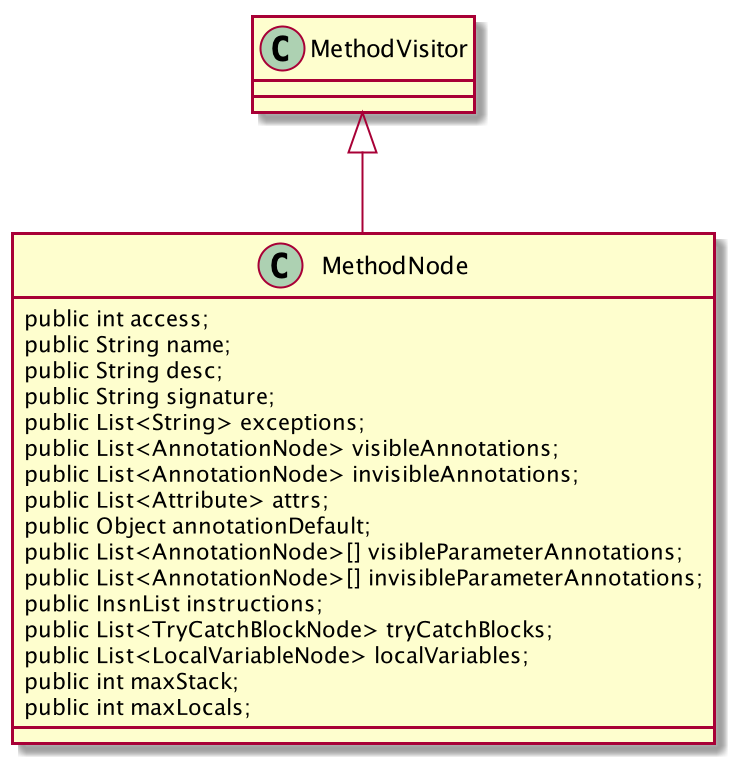
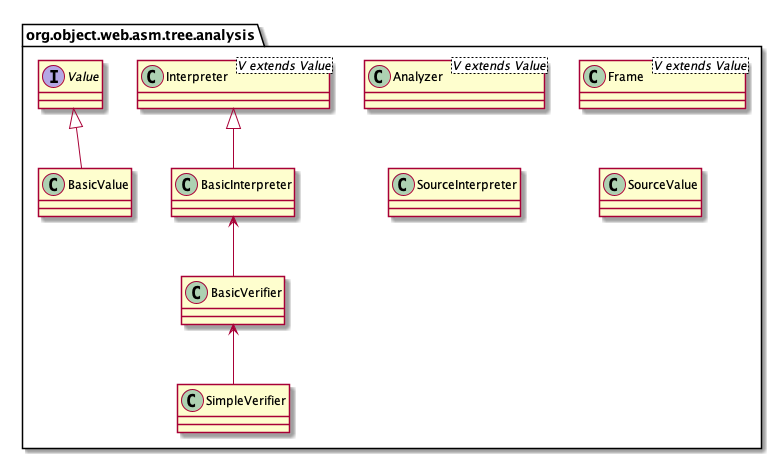

### 1. ASM 介绍

`ASM` 是一个 `Java` 字节码操作框架，它能用来动态生成类或者增强既有类的功能。`ASM` 可以直接生成二进制 `class` 文件，也可以在类被加载到 `Java` 虚拟机之前动态改变类行为。`ASM` 框架中提供了常见的字节码分析和生成工具，可以快速进行类的生成或分析转换。

在 `Android` 开发中， `Android Gradle 1.5` 版本后提供的 `Transform` 机制, 它允许第三方的 `Plugin` 插件在 `.class` 文件打包成 `dex` 之前进行动态修改，这就为动态修改字节码文件提供了入口，衍生出很多“插桩”的功能，比如埋点、插入日志等。

`ASM` 在很多出色的项目中都有使用：

- [OpenJDK](http://openjdk.java.net/)，用于生成 `Lambda` 的调用点
- [Groovy](http://www.groovy-lang.org/) 编译器和 [Kotlin](https://kotlinlang.org/) 编译器
- [Gradle](https://gradle.org/), 用于在运行时生成代码

`ASM` 官方提供了一本[入门的电子书（纯英文）](https://asm.ow2.io/asm4-guide.pdf)，当然国内也有汉化版，可以百度搜索。由于书中涉及到大量的代码片段，我在学习的过程中已经将代码片段整理成可执行的 `Java` 程序，并放到 `GitHub` 仓库中，仓库地址 [**https://github.com/dengshiwei/asm-module**](https://github.com/dengshiwei/asm-module)。

#### 1.1 框架结构

在 `ASM` 中提供了两大框架用于类的生成和解析。一类是**基于事件**的形式来表示类，称之为核心 `API`，另一类是以**基于对象**的形式来表示类，称之为树 `API`。有点类似于 `XML` 文件解析中的 `SAX` 和 `DOM` 解析。

在核心 `API` 中，类是用一系列事件来表示的，每个事件表示类的一个元素，比如它的一个标头、一个字段、一个方法声明、一条指令，等等。基于事件的 `API` 定义了一组可能事件，以及这些事件必须遵循的发生顺序，还提供了一个类分析器（`ClassReader`），为每个被分析元素生成一个事件，还提供一个类写入器（`ClassWriter`），由这些事件的序列生成经过编译的类。

在树 `API` 中，类用一个对象树表示，比如一个类用 `ClassNode` 对象表示，一个方法用 `MethodNode` 对象表示。每个对象中都包含指向它组成对象的引用。比如 `ClassNode` 中包含很多组成它的 `MethodNode`。基于对象的 `API` 提供了一种方法，可以将表示一个类的事件序列转换为表示同一个类的对象树，也可以反过来，将对象树表示为等价的事件序列。换言之，基于对象的 `API` 构建在基于事件的 `API` 之上。

#### 1.2 ASM 源码目录结构

我们将 `ASM` 按照包名路径划分，大致的类图框架如下。


从中可以看到大致有：

- [org.objectweb.asm](https://asm.ow2.io/javadoc/org/objectweb/asm/package-summary.html)：包中定义类基于核心 `API` 的相关操作类；
- [org.objectweb.asm.commons](https://asm.ow2.io/javadoc/org/objectweb/asm/commons/package-summary.html)：包中提供了实用的类或方法的 `Adapter` 方法转换器；
- [org.objectweb.asm.signature](https://asm.ow2.io/javadoc/org/objectweb/asm/signature/package-summary.html)：保重定义了泛型相关的操作类；
- [org.objectweb.asm.tree](https://asm.ow2.io/javadoc/org/objectweb/asm/tree/package-summary.html)：包中定义了基于树 `API` 的类，以及一些用于事件和树 `API` 转换的工具类；
- [org.objectweb.asm.tree.analysis](https://asm.ow2.io/javadoc/org/objectweb/asm/tree/analysis/package-summary.html)：包中提供了常见的类分析框架和分析器类；
- [org.objectweb.asm.util](https://asm.ow2.io/javadoc/org/objectweb/asm/util/package-summary.html)：包中提供了基于核心 `API` 的常见工具类。

**org.objectweb.asm**

包中定义了核心 `API` 的类，其中 `ClassVisitor`、`FieldVisitor`、`MethodVisitor` 和 `AnnotationVisitor` 四个抽象类，用于访问 `.class` 字节码文件中的 `fields`、 `methods` 和 `annotations` 相关的指令。除此之外，核心 `API` 中还提供 `ClassReader` 用于转换一个 `Java` 文件可以被 `ASM` 中的 `API` 访问。通过 `ClassWriter` 用于生成字节码文件。

**org.objectweb.asm.commons**

保中提供了很有用的工具类和适配器。比如 `AdaviceAdapter`、`LocalVariablesSorter`、`AnalyzerAdapter` 等等。在需要混合使用这些工具类，建议通过委托的方式进行功能扩展，而不是通过继承。

**org.objectweb.asm.signature**

包中定义类泛型相关的操作类， `SignatureReader`、`SignatureVisitor` 和 `SignatureWriter` 分别用于泛型的读取转换、访问和生成。

**org.object.web.tree**

包中提供了树 `API` 的相关操作。比如标识一个类的节点类 `ClassNode`，标识一个方法的节点类 `MethodNode`。

**org.objectweb.asm.tree.analysis**

包中定义了基于树 `API` 的类分析和校验框架，比如 `BasicInterpreter` 基础分析器、`BasicVerifier` 基础校验器用来校验字节指令是否调用正确。

**org.object.asm.util**

包中提供了一些工具类，用于开发调试时使用。比如 `CheckClassAdapter` 用于校验字节码文件是否正确、`CheckMethodAdapter` 用于校验方法调用是否正确、`Textifier` 用于输出字节码指令、`TraceClassVisitor` 打印出类的所有的访问。这些类通常不会在运行时使用，这也是把它们和 `asm.jar` 核心 `API` 进行剥离的原因。

### 2. 核心 API

在 `ASM` 的核心 `API` 中，按照对 `class` 文件处理的划分有：类处理（`ClassVisitor`、`ClassReader`）、注解处理（`AnnotationVisitor`）、方法处理（`MethodVisitor`）和字段处理（`FiledVisitor`）。


#### 2.1 ClassVisitor

用于访问 `Java` 类文件。



在访问一个类文件时，它的回调方法必须按照以下顺序访问：`visit` 【 `visitSource` 】【 `visitModule` 】【 `visitNestHost` 】【 `visitPermittedclass` 】【 `visitOuterClass` 】 ( `visitAnnotation` | `visitTypeAnnotation` | `visitAttribute` )* ( `visitNestMember` | `visitInnerClass` | `visitRecordComponent` | `visitField` | `visitMethod` )* `visitEnd`。

方法说明：

- `visit` ：访问类的头部，其中 `version` 指类创建时使用的 `JDK` 的版本，比如 `50` 代表 `JDK1.6`、`51` 代表 `JDK1.7`。`access` 代表类的访问权限，比如 `public `、`private`。`name` 表示类名。`signature` 表示类的签名，如果类不是泛型或者没有继承泛型类，那么`signature` 值为空。`superName` 表示父类的名称。`interfaces` 表示实现的接口；
- `visitSource` ：访问类源文件；
- `visitModule`：访问 `Module` 模块， `Java9` 中新增关键字 `module` 用于定义代码和数据的封装体；
- `visitNestHost`：访问嵌套类；
- `visitOuterClass`：访问外部类；
- `visitAnnotation`：访问类的注解；
- `visitTypeAnnotation`：访问类的泛型签名的注解；
- `visitField`：访问类的 `Field` 字段；
- `visitMethod`：访问类的方法；
- `visitEnd`：结束。

在 `ASM`  的核心 `API` 中，基于 `ClassVisitor` 的三个组件：

- `ClassReader` 用于解析分析分析类文件，转成 `ASM` 框架能分析的格式。然后在 `accept` 方法中接收一个 `ClassVisitor` 对象用于访问该类；
- `ClassWriter` 是 `ClassVisitor` 的子类，直接通过二进制的形式生成类；
- `ClassVisitor` 类可以看作一个事件筛选器，完成对类的访问遍历。

[示例代码](https://github.com/dengshiwei/asm-module/blob/master/asm_example/src/main/java/com/andoter/asm_example/part2/ConvertDemo.kt)：

```kotlin
fun main() {
    // 第一种方式中，如果在 ConvertVisitor 中仅仅在 visit 方法中使用 classwrite 修改了 version 版本，此时处理后的信息日志输出中只有 visitor。需要
    // 在 visitMethod 中也调用 classWrite 进行输出才行,而不是 调用 super
    val classWriter = ClassWriter(ClassWriter.COMPUTE_MAXS)
    val classReader = ClassReader("com.andoter.asm_example.part2.ConvertDemo")
    val classVisitor = ChangeVersionVisitor(Opcodes.ASM7, classWriter)
    classReader.accept(classVisitor, ClassReader.SKIP_CODE)
}
```

##### 1. ClassReader

用于将 `Java` 类文件转换成 `ClassVisitor` 能访问的结构。它有四个构造函数，分别支持 `byte[]`、`InputStream`、`File Path` 三种输入方式，这三种输入类型的构造方法如下：

- `ClassReader(byte[] classFile)`：以文件字节数组作为参数构建 `ClassReader`；
- `ClassReader(java.io.InputStream inputStream)`：以文件字节流作为参数；
- `ClassReader(java.lang.String className)`：以文件全路径名作为参数。

同时 `ClassReader` 类中还提供读取 `Class` 文件信息的方法，比如 `getClassName()`、`getAccess()`、`readByte(int offset)`。其中比较重要的一个方法是 `accept` 方法，该方法中接收一个 `ClassVisitor` 对象，用于完成对字节码的方法。

```java
accept(ClassVisitor classVisitor, int parsingOptions)
```

`parsingOptions` 转换参数取值有：

- `EXPAND_FRAMES`：处理 `StackMapTable` 属性信息，对于小于 JDK1.6 的类文件是默认展开的，其它是默认压缩的。使用此配置， `StackMapTable` 属性信息会全部按照展开进行处理，并可以访问到；
- `SKIP_CODE`：忽略 `Code` 属性信息(`attribute_info`)；
- `SKIP_DEBUG`：忽略 `SourceFile`、`SourceDebugExtension`、`LocalVariableTable`、`LocalVariableTypeTable`、`LineNumberTable` 和 `MethodParameters` 属性信息(`attribute_info`)，同时对应的 `visitXX` 方法也不会调用，比如 `visitSource`、`visitLocalVariable`；
- `SKIP_FRAMES`：忽略 `StackMap` 和 `StackMapTable` 属性信息，对应的 `visitFrame()` 方法不会调用。

[示例代码](https://github.com/dengshiwei/asm-module/blob/master/asm_example/src/main/java/com/andoter/asm_example/part2/ClassReaderDemo.kt)：

```java
fun main() {
    val classReader = ClassReader("java.util.ArrayList")
    val classVisitor = ClassPrintVisitor(Opcodes.ASM7)
    classReader.accept(classVisitor, ClassReader.SKIP_DEBUG)
}
```

##### 2. ClassWriter

用于生成符合 `JVM` 规范的字节码文件，可以单独使用进行生成字节码文件，也可以配合 `ClassReader` 或 `ClassVisitor` 适配器进行现有类文件的修改。`ClassWriter` 提供了两种创建方式，一种是单独创建，另一种是以 `ClassReader` 作为参数。

- `ClassWriter(int flags)`：创建新的 `ClassWriter`对象；
- `ClassWriter(ClassReader classReader, int flags)`：以 `ClassReader` 作为参数创建新的对象，这种方式可以极大提高修改时的效率。

在上面的构造方法中，`Flag` 有两种类型取值：

- `COMPUTE_FRAMES`：自动计算栈帧信息，即计算全部，必须调用 `visitMaxs(int)`，但是不必调用 `visitFrame()`；
- `COMPUTE_MAXS`：自动计算最大的操作数栈和最大的局部变量表，但是必须调用 `visitMaxs(int)` 方法，可以使用任何参数，它会被重新计算覆盖，但是该方式需要自行计算帧；
- `0`：不计算任何东西，必须由开发者手动进行计算帧、局部变量、操作数栈的大小。

`COMPUTE_MAXS` 选项使 `ClassWriter` 的速度降低 10%，而使用 `COMPUTE_FRAMES` 选项则使其降低一半。

`ClassWriter` 是 `ClassVisitor` 的子类，所以那些 `visitXX` 类的方法在 `ClassWriter` 具有生成字段或方法的功能。比如生成一个字段，我们调用 `visitField()`，生成一个方法可以调用 `visitMethod`。最后，必须调用 `visitEnd()` 方法表示结束。

依照 `ASM` 书中的示例：

```kotlin
fun main() {
    val classWriter = ClassWriter(0)
    classWriter.visit(Opcodes.V1_7, Opcodes.ACC_PUBLIC + Opcodes.ACC_ABSTRACT + Opcodes.ACC_INTERFACE,
        "pkg/Comparable",null, "java/lang/Object", arrayOf("pkg/Mesureable"))
    classWriter.visitField(Opcodes.ACC_PUBLIC+ Opcodes.ACC_FINAL + Opcodes.ACC_STATIC, "LESS", "I", null,  -1).visitEnd()
    classWriter.visitField(Opcodes.ACC_PUBLIC+ Opcodes.ACC_FINAL + Opcodes.ACC_STATIC, "EQUAL", "I", null,  0).visitEnd()
    classWriter.visitField(Opcodes.ACC_PUBLIC+ Opcodes.ACC_FINAL + Opcodes.ACC_STATIC, "GREATER", "I", null,  1).visitEnd()
    classWriter.visitMethod(Opcodes.ACC_PUBLIC + Opcodes.ACC_ABSTRACT, "compareTo", "(Ljava/lang/Object;)I" ,null, null).visitEnd()
    classWriter.visitEnd()
    val writeByte = classWriter.toByteArray()

    // 输出字节码，然后通过 javap 指令查看输出
    ClassOutputUtil.byte2File("asm_example/files/Comparable.class", writeByte)
}
```

看到这里，让大家写出这些字节码就很困难了，不过不用担心，现在可以在 `IDE` 中安装一个插件 `ASM Bytecode Outline`，启用后选中文件双击右键或在`「 IDE 的 Code」`选项卡中，选择 `Show Bytecode outline` 可以直接查看转换后的字节码和 `ASM` 字节码指令。

##### 3. TraceClassVisitor

`ClassWriter` 输出的是字节数组，对于我们确认修改后的字节码是否符合预期用处并不大，在 `ASM` 中提供了 `TraceClassVisitor` 用来输出字节码指令。或者通过 `File` 文件流操作，将 `ClassWriter` 的字节数组输出为文件，然后利用 `javap` 指令来查看是否符合预期。使用方式是将 `ClassWriter` 对象委托给 `TraceClassVisitor`。

[示例代码](https://github.com/dengshiwei/asm-module/blob/master/asm_example/src/main/java/com/andoter/asm_example/part2/TraceClassVisitorDemo.kt)：

```kotlin
fun main() {
    val classWriter = ClassWriter(0)
    /*
     使用 TraceClassVisitor，同时使用 System.out 流将结果输出。
     另外测试时还有一种写法，输出到文件。PrintWriter("asm_example/files/TraceClassVisitorDemo.class") 但是输出的文件通过 javap -v 指令查看会报错。
     详情可参照：https://stackoverflow.com/questions/63443099/asm-traceclassvisitor-output-file-is-error
     */
    val traceClassWriter =
        TraceClassVisitor(classWriter, PrintWriter(System.out))
    traceClassWriter.visit(
        Opcodes.V1_7,
        Opcodes.ACC_PUBLIC + Opcodes.ACC_INTERFACE + Opcodes.ACC_ABSTRACT,
        "com.andoter.asm_example.part2/TraceClassVisitorDemo",
        null,
        "java/lang/Object",
        null
    )
    traceClassWriter.visitSource("TraceClassVisitorDemo.class", null)
    traceClassWriter.visitField(Opcodes.ACC_PUBLIC+ Opcodes.ACC_FINAL + Opcodes.ACC_STATIC, "className", "Ljava/lang/String;", null, "").visitEnd()
    traceClassWriter.visitField(Opcodes.ACC_PUBLIC+ Opcodes.ACC_FINAL + Opcodes.ACC_STATIC, "classVersion", "I", null, 50).visitEnd()
    traceClassWriter.visitMethod(
        Opcodes.ACC_PUBLIC + Opcodes.ACC_ABSTRACT,
        "getTraceInfo",
        "()Ljava/lang/String;",
        null,
        null
    ).visitEnd()
    traceClassWriter.visitEnd()

    ClassOutputUtil.byte2File("asm_example/files/TraceClassVisitorDemo1.class", classWriter.toByteArray())
}
```

##### 4. CheckClassAdapter

`ClassWriter` 类并不会核实对其方法的调用顺序是否恰当，以及参数是否有效。因此，有可能会生成一些被 `Java` 虚拟机验证器拒绝的无效类。在 `ASM` 中可以使用 `CheckClassAdapter` 类进行提前检测。使用方式是将 `ClassWriter` 对象委托给 `CheckClassAdapter`。

[示例代码](https://github.com/dengshiwei/asm-module/blob/master/asm_example/src/main/java/com/andoter/asm_example/part2/CheckClassAdapterDemo.kt)：

```kotlin
fun main() {
    val classWriter = ClassWriter(0)
    val checkClassAdapter = CheckClassAdapter(classWriter)
    checkClassAdapter.visit(
        Opcodes.V1_7, Opcodes.ACC_PUBLIC + Opcodes.ACC_ABSTRACT + Opcodes.ACC_INTERFACE,
        "pkg/Comparable",null, "java/lang/Object1", arrayOf("pkg/Mesureable"))
    checkClassAdapter.visitField(Opcodes.ACC_PUBLIC+ Opcodes.ACC_FINAL + Opcodes.ACC_STATIC, "LESS", "I", null,  -1).visitEnd()
    checkClassAdapter.visitField(Opcodes.ACC_PUBLIC+ Opcodes.ACC_FINAL + Opcodes.ACC_STATIC, "EQUAL", "I", null,  0).visitEnd()
    checkClassAdapter.visitField(Opcodes.ACC_PUBLIC+ Opcodes.ACC_FINAL + Opcodes.ACC_STATIC, "GREATER", "I", null,  1).visitEnd()
    // 比如这里，我们将 Ljava/lang/Object 修改为 Ljava/lang/Object1，此时编译就会报错
    checkClassAdapter.visitMethod(Opcodes.ACC_PUBLIC + Opcodes.ACC_ABSTRACT, "compareTo", "(Ljava/lang/Object;)I" ,null, null).visitEnd()
    checkClassAdapter.visitEnd()
    val writeByte = classWriter.toByteArray()

    // 输出字节码，然后通过 javap 指令查看输出
    ClassOutputUtil.byte2File("asm_example/files/Comparable.class", writeByte)
}
```

在 `ClassVisitor` 中还涉及到一些其它知识，比如[转换类](https://github.com/dengshiwei/asm-module/blob/master/asm_example/src/main/java/com/andoter/asm_example/part2/ConvertDemo.kt)、[移除一个类的成员](https://github.com/dengshiwei/asm-module/blob/master/asm_example/src/main/java/com/andoter/asm_example/part2/RemoveDebugAdapter.kt)或者[新增类成员](https://github.com/dengshiwei/asm-module/blob/master/asm_example/src/main/java/com/andoter/asm_example/part2/AddFieldDemo.kt)等，这里可以参照 ASM 入门手册中的讲解。

#### 2.2 MethodVisitor

用于对方法的处理，比如访问一个方法，或者生成方法。



在访问方法时，会按照以下顺序进行处理：`( visitParameter )* 【 visitAnnotationDefault 】 ( visitAnnotation | visitAnnotableParameterCount | visitParameterAnnotation visitTypeAnnotation | visitAttribute )* 【 visitCode ( visitFrame | visit<i>X</i>Insn | visitLabel | visitInsnAnnotation | visitTryCatchBlock | visitTryCatchAnnotation | visitLocalVariable | visitLocalVariableAnnotation | visitLineNumber )* visitMaxs 】 visitEnd`。

方法说明：

- `visitCode`：开始访问方法；
- `visitParameter(String name, int access)`：访问方法参数；
- `visitAnnotation`：访问方法的注解；
- `visitParameterAnnotation`：访问方法参数的注解；
- `visitFrame`：访问当前栈帧，即当前的局部变量表和操作数栈的状态；
- `visitFieldInsn`：访问一个字段时的指令，即加载一个字段(`load`)或保存一个字段值(`store`)；
- `visitIincInsn`：访问一个 `IINC` 指令；
- `visitIntInsn(int opcode, int operand)`：访问一个 `int` 数值类型指令,当 `int` 取值 `-1~5` 采用 `ICONST` 指令，取值 `-128~127` 采用 `BIPUSH` 指令，取值 `-32768~32767` 采用 `SIPUSH` 指令，取值 `-2147483648~2147483647` 采用 `ldc` 指令；
- `visitInvokeDynamicInsn`：访问一个 `invokedynamic` 指令，一般是 `Lambda` 访问时；
- `visitJumpInsn(int opcode, Label label)`：访问一个 `Jump` 指令；
- `visitLdcInsn(Object value)`：访问一个 `LDC` 常量，并加载到操作数栈；
- `visitMethodInsn(int opcode, String owner, String name, String descriptor, boolean isInterface)`：访问方法时的指令，即调用方法的指令，比如在一个方法中调用另一个方法；
- `visitVarInsn(int opcode, int var)`：访问局部变量指令，局部变量指令是加载或存储局部变量值的指令；
- `visitLineNumber(int line, Label start)`：访问方法行号声明；
- `visitTryCatchBlock`：访问 `try..catch` 块；
- `visitInsn(int opcode)`：访问一个字节码指令，比如 `IADD`、`ISUB`、`F2L`、`LSHR` 等；
- `visitMax(int maxStack, int maxLocals)`：方法的局部变量表和操作数栈的最大个数；
- `visitEnd`：方法访问结束，结束时必须调用。

`MethodVisitor` 提供了很多 `visitXXXInsn` 的指令供我们操作局部变量表和操作数栈。但是在使用的过程中这些 `visitXXXInsn` 指令在访问时有严格的字节码指令顺序要求，比如 `visitInsnAnnotation` 指令必须在 `Annotation` 指令之后调用。`visitTryCatchBlock` 必须在即将访问的 `Label` 作为参数之前进行访问，`visitLocalVariable`、`visitLocalVariableAnnotation` 和 `visitLineNumber` 必须在作为参数的 `Label` 之后访问。

我们通过 `ClassWriter`配合 `MethodVisitor`来生成 `Bean` 类的 `getF()` 方法。[示例代码](https://github.com/dengshiwei/asm-module/blob/master/asm_example/src/main/java/com/andoter/asm_example/part3/GenerateMethod.kt)：

```kotlin
class Bean{
    private var f:Int =1
    fun getF(): Int {
        return this.f
    }

    fun setF(value: Int) {
        this.f = value
    }
}

/*
   // access flags 0x11
    public final getF()I
    L0
    LINENUMBER 9 L0
    ALOAD 0
    GETFIELD com/andoter/asm_example/part3/Bean.f : I
    IRETURN
    L1
    LOCALVARIABLE this Lcom/andoter/asm_example/part3/Bean; L0 L1 0
    MAXSTACK = 1
    MAXLOCALS = 1
 */
fun main() {
    val classWriter = ClassWriter(0)
    classWriter.visit(
        Opcodes.V1_7,
        Opcodes.ACC_PUBLIC + Opcodes.ACC_FINAL,
        "pkg/Bean",
        null,
        "java/lang/Object",
        null
    )
    val methodVisitor = classWriter.visitMethod(Opcodes.ACC_PUBLIC + Opcodes.ACC_FINAL, "getF",
        "()I", null, null)
    methodVisitor.visitCode() // 开始生成方法
    methodVisitor.visitVarInsn(Opcodes.ALOAD, 0)	// 从局部变量表 load 位置为 0 的变量到操作数栈，第一个为 this
    methodVisitor.visitFieldInsn(Opcodes.GETFIELD, "pkg/Bean", "f", "I") // 读取 Bean 的 f 字段
    methodVisitor.visitInsn(Opcodes.IRETURN) // 返回
    methodVisitor.visitMaxs(1, 1)//定义执行栈帧的局部变量表和操作数栈的大小
    methodVisitor.visitEnd() // 方法访问结束
    classWriter.visitEnd()
    /*
     * 输出的字节码文件：
     *  package pkg;
        public final class Bean {
            public final int getF() {
                return this.f;
            }
        }
     */
    ClassOutputUtil.byte2File("asm_example/files/Bean.class", classWriter.toByteArray())
}
```

在这段示例代码中，首先通过 `ClassWriter` 的 `visitMethod` 获取一个 `MethodVisitor` 对象，然后调用 `visitCode` 开始进行生成，紧接着读取出 `this`，然后读取出字段 `f`，最后执行 `IREATUREN	` 进行返回，调用 `visitMaxs()` 定义整个过程中局部变量表和操作数栈的最大只，调用 `visitEnd` 表示结束。

##### 1. 执行结构

前面的介绍中，多次提到局部变量表和操作数栈的概念。在 `Java` 虚拟机中，栈数据结构是线程独享的，即每个线程都有自己的执行栈，**栈是由很多栈帧组成**，每个栈帧表示一个方法的调用，当调用一个方法时，会在执行栈中压入一个栈帧，同时方法执行完毕时，会将这个栈帧从执行栈中弹出。所以当前正在执行的方法的栈帧是在顶部。

**栈帧主要的组成部分：局部变量表、操作数栈、动态链接和方法返回地址信息。**

**a. 局部变量表**

局部变量表是一组变量值的存储空间，用于存放方法参数和方法内部定义的局部变量。**在 .java 编译成 .class 文件时，已经确定了所需要分配的局部变量表和操作数栈的大小。**

**局部变量表的容量单位是变量槽(Variable Slot)。**每个变量槽最大的存储长度是 `32` 位，所以对于` byte`、`char`、`boolean`、`short`、`int`、`float`、`reference` 是占用 `1` 个变量槽，对于 double、long 类型占用 `2` 个变量槽。

在局部变量表中，通过索引来定位局部变量的位置，索引值的范围从 0 开始到最大的局部变量占用的槽数。如果执行的是对象实例的成员方法（不是 `static` 修饰的方法），那么局部变量表中第 `0` 位索引的变量槽默认就是该对象实例的引用(`this`)。

**变量槽复用**

为了节省栈帧空间，局部变量表中的变量槽是可以复用的，当一个槽使用完毕后，这个变量槽就可以交给其它变量复用。

- 将一个值存储在局部变量表中，在以不同的类型加载它是非法操作，比如存入 `ISTORE` 类型，使用 `FLOAD` 加载
- 如果向一个局部变量表中的位置存储一个值，而这个值不同于原来的存储类型，这种操作是合法的

**以上两个特性，意味着：一个局部变量的类型，可能在方法执行期间发生变化。**比如你在方法的最后读取局部变量，在第 1 个变量槽的位置上存储的是 `int` 类型，后面可能就被复用，导致值发生变化。

**b. 操作数栈**

操作数栈和局部变量表一样，在编译时期就已经确定所需要分配的操作数栈的最大容量。操作数栈的每一个位置可以是任意的 `Java` 数据类型，`32` 位数据类型所占的栈容量为 `1`，`64` 位数据类型占用的栈容量为 `2`。

当一个方法开始执行的时候，所对应的操作数栈是空的，在方法执行的过程中，会有各种字节码指令往操作数栈中写入和提取内容，也就是出栈 / 入栈操作，最终操作数栈的值也在发生改变。

**c. 字节码指令**

字节码指令由一个标识该指令的操作码和固定数目的参数组成：
- 操作码是一个无符号字节值，即字节代码名，由注记符号标识；
- 参数是静态值，确定了精确的指令行为，紧跟在操作码之后。

字节码指令大致可以分为两类，一类指令用于局部变量和操作数栈之间传递值。另一类用于对操作数栈的值
进行弹出和计算，并压入栈中。

常见的局部变量操作指令有：
- `ILOAD`：用于加载 `boolean`、`int`、`byte`、`short` 和 `char` 类型的局部变量到操作数栈；
- `FLOAD`：用于加载 `float` 类型局部变量到操作数栈；
- `LLOAD`：用于加载 `lang` 类型局部变量到操作数栈，需要加载两个槽 `slot`；
- `DLOAD`：用于加载 `double` 类型局部变量到操作数栈，需要加载两个槽 `slot`；
- `ALOAD`：用于加载非基础类型的局部变量到操作数栈，比如对象之类的。

常见的操作数栈指令有：
- `ISTORE`：从操作数栈弹出 `boolean`、`int`、`byte`、`short` 和 `char` 类型的局部变量，并将它存储在由其索引 `i` 指定的局部变量中；
- `FSTORE`：从操作数栈弹出 `float` 类型的局部变量，并将它存储在由其索引 `i` 指定的局部变量中；
- `LSTORE`：从操作数栈弹出 `long` 类型的局部变量，并将它存储在由其索引 `i` 指定的局部变量中；
- `DSTORE`：从操作数栈弹出 `double` 类型的局部变量，并将它存储在由其索引 `i` 指定的局部变量中；
- `ASTORE`：用于弹出非基础类型的局部变量，并将它存储在由其索引 `i` 指定的局部变量中。

##### 2. CheckMethodAdapter

同 `ClassVisitor` 一样，`MethodVisitor` 本身也不会检查调用顺序是否适当，所以对于 `Method` 的操作，`ASM` 提供了 `CheckMethodAdapter` 用于检测方法调用顺序是否在正确。使用方式是将 `MethodVisitor` 对象委托给 `CheckMethodAdapter`。

[示例代码](https://github.com/dengshiwei/asm-module/blob/master/asm_example/src/main/java/com/andoter/asm_example/part3/CheckMethodDemo.kt)：

```kotlin
fun main() {
    val classReader = ClassReader("com.andoter.asm_example.part3.MyMethodAdapter")
    val classWriter = ClassWriter(classReader, ClassWriter.COMPUTE_MAXS)
    val classVisitor = object : ClassVisitor(Opcodes.ASM7, classWriter) {
        override fun visitMethod(
            access: Int,
            name: String?,
            descriptor: String?,
            signature: String?,
            exceptions: Array<out String>?
        ): MethodVisitor {
            var methodVisitor = cv.visitMethod(access, name, descriptor, signature, exceptions)
            // 将 MethodVisitor 委托给 CheckMethodAdapter
            methodVisitor = CheckMethodAdapter(methodVisitor)
            return MyMethodAdapter(methodVisitor)
        }
    }
    classReader.accept(classVisitor, ClassReader.SKIP_DEBUG)
}
```

##### 3. LocalVariablesSorter

该工具类将局部变量按照他们出现的顺序进行重新编号，同时可以很方便的使用 `newLocal` 方法创建一个新的局部变量。比如对于一个有两个参数的方法，插入一个新的局部变量时，新的局部变量索引就是 `3`。所以这个方法对于在方法中插入局部变量很有用。

[示例代码](https://github.com/dengshiwei/asm-module/blob/master/asm_example/src/main/java/com/andoter/asm_example/part3/AddTimerAdapter4.kt)：

```kotlin
class AddTimerMethodAdapter4(
    private var owner: String,
    access: Int,
    descriptor: String?,
    methodVisitor: MethodVisitor?
) : LocalVariablesSorter(Opcodes.ASM7, access, descriptor, methodVisitor ){
    private var time:Int = -1

    override fun visitCode() {
        super.visitCode()
        mv.visitMethodInsn(Opcodes.INVOKESTATIC, "java/lang/System", "currentTimeMillis", "()J", false)
        time = newLocal(Type.LONG_TYPE) // 新建一个局部变量
        mv.visitVarInsn(Opcodes.LSTORE, time)
    }

    override fun visitInsn(opcode: Int) {
        if (opcode >= Opcodes.IRETURN && opcode <= Opcodes.RETURN || Opcodes.ATHROW == opcode) {
            mv.visitMethodInsn(Opcodes.INVOKESTATIC, "java/lang/System", "currentTimeMillis", "()J", false)
            mv.visitVarInsn(Opcodes.LLOAD, time)
            mv.visitInsn(Opcodes.LSUB)
            mv.visitFieldInsn(Opcodes.GETSTATIC, owner, "timer", "J")
            mv.visitInsn(Opcodes.LADD)
            mv.visitFieldInsn(Opcodes.PUTSTATIC, owner, "timer", "J")
        }
        super.visitInsn(opcode)
    }

    override fun visitMaxs(maxStack: Int, maxLocals: Int) {
        super.visitMaxs(maxStack + 4, maxLocals)
    }
}
```

##### 4. AdaviceAdapter

该类是一个抽象类，可以方便在方法的开头或者任意的结束位置进行代码的插入。主要的好处是可以检测到构造函数，这个适配器大多数的代码都是为了检测构造函数。该类属于 `LocalVariablesSorter` 的子类，所以也同样可以直接通过 `newLocal()` 方法创建新的局部变量。

[示例代码](https://github.com/dengshiwei/asm-module/blob/master/asm_example/src/main/java/com/andoter/asm_example/part3/AddTimerAdapter6.kt)：

```kotlin
class AddTimerMethodAdapter6(
    private var owner: String,
    methodVisitor: MethodVisitor?,
    access: Int,
    name: String?,
    descriptor: String?
) : AdviceAdapter(Opcodes.ASM7, methodVisitor, access, name, descriptor) {

    override fun onMethodEnter() {
        mv.visitFieldInsn(GETSTATIC, owner, "timer", "J")
        mv.visitMethodInsn(
            INVOKESTATIC, "java/lang/System",
            "currentTimeMillis", "()J", false
        )
        mv.visitInsn(LSUB)
        mv.visitFieldInsn(PUTSTATIC, owner, "timer", "J")
    }

    override fun onMethodExit(opcode: Int) {
        mv.visitFieldInsn(GETSTATIC, owner, "timer", "J")
        mv.visitMethodInsn(
            INVOKESTATIC, "java/lang/System",
            "currentTimeMillis", "()J", false
        )
        mv.visitInsn(LADD)
        mv.visitFieldInsn(PUTSTATIC, owner, "timer", "J")
    }

    override fun visitMaxs(maxStack: Int, maxLocals: Int) {
        mv.visitMaxs(maxStack + 4, maxLocals)
    }
}
```

#### 2.3 FieldVisitor

用于 `Field` 字段的详细信息访问，比如字段上的注解。



访问时按照以下顺序执行：` ( visitAnnotation | visitTypeAnnotation | visitAttribute )* visitEnd`。

方法说明：

- `visitAnnotation(String descriptor, boolean visible)`：访问字段上的注解
- `visitAttribute(Attribute attribute)`：访问字段上的属性
- `visitEnd()`：访问结束
- `visitTypeAnnotation()`：访问字段上 `Type` 类型的注解

`FieldVisitor` 接口演示示例代码：

```kotlin
class FiledVisitorPrinter(fieldVisitor: FieldVisitor?) : FieldVisitor(Opcodes.ASM7, fieldVisitor) {
    override fun visitEnd() {
        super.visitEnd()
        ADLog.info("visitEnd")
    }

    override fun visitAnnotation(descriptor: String?, visible: Boolean): AnnotationVisitor {
        ADLog.info("visitAnnotation, des = $descriptor, visiable = $visible")
        return super.visitAnnotation(descriptor, visible)
    }

    override fun visitTypeAnnotation(
        typeRef: Int,
        typePath: TypePath?,
        descriptor: String?,
        visible: Boolean
    ): AnnotationVisitor {
        return super.visitTypeAnnotation(typeRef, typePath, descriptor, visible)
    }

    override fun visitAttribute(attribute: Attribute?) {
        super.visitAttribute(attribute)
    }
}
```

使用 `FieldVisitor` 新增一个字段，[示例代码](https://github.com/dengshiwei/asm-module/blob/master/asm_example/src/main/java/com/andoter/asm_example/part2/AddFieldDemo.kt)：

```kotlin
class AddFieldAdapter(private var version:Int, classVisitor: ClassVisitor) : ClassVisitor(version, classVisitor){
    var isExists = false
    lateinit var filedName: String
    private var filedAccessFlag: Int = Opcodes.ACC_PUBLIC
    lateinit var fieldDescription: String
    lateinit var classVisitor: ClassVisitor
    constructor(version: Int, classVisitor: ClassVisitor, filedName:String, filedAccess:Int, fieldDescription: String) :this(version, classVisitor){
        this.classVisitor = classVisitor
        this.filedAccessFlag = filedAccess
        this.fieldDescription = fieldDescription
        this.filedName = filedName
    }

    override fun visit(version: Int, access: Int, name: String?, signature: String?, superName: String?, interfaces: Array<out String>?) {
        ADLog.info("visit, version = $version, access = ${AccessCodeUtils.accCode2String(access)}, name = ${name}, signature = $signature")
        super.visit(version, access, name, signature, superName, interfaces)
    }

    override fun visitField(access: Int, name: String?, descriptor: String?, signature: String?, value: Any?): FieldVisitor? {
        ADLog.info("visitField: access=${AccessCodeUtils.accCode2String(access)},name=$name,descriptor=$descriptor," +
                "signature=$signature,value=$value")
        if (name == "name") {
            println("存在字段 name,value = ")
        }

        if (this.filedName == name) {
            this.isExists = true
        }
        return super.visitField(access, name, descriptor, signature, value)
    }

    override fun visitEnd() {
        super.visitEnd()
        if (!isExists) {
            val filedVisitor = cv.visitField(filedAccessFlag, filedName, fieldDescription, null, null)
            filedVisitor?.visitEnd()
        }
        ADLog.info("visitEnd")
    }
}
```

在上面的示例代码中，在 `visitField` 中检测字段是否存在，如果字段存在，则在 `visitEnd` 中不进行插入，如果不存在，则插入对应的字段。

##### 1. CheckFieldAdapter

同 `ClassVisitor` 一样，`FieldVisitor` 本身也不会检查调用顺序是否适当，所以对于 `Field` 的操作，`ASM` 提供了 `CheckFieldAdapter` 用于检测调用顺序是否在正确。使用方式是将 `FieldVisitor` 对象委托给 `CheckFieldAdapter`。

```kotlin
fun main() {
    val classReader = ClassReader("com.andoter.asm_example.field.CheckFieldInsn")
    val classWriter = ClassWriter(classReader, ClassWriter.COMPUTE_MAXS)
    classReader.accept(object: ClassVisitor(Opcodes.ASM7, classWriter){
        var isExist = false
        override fun visitField(
            access: Int,
            name: String?,
            descriptor: String?,
            signature: String?,
            value: Any?
        ): FieldVisitor? {
            if (name == "TAG") {
                isExist = true
            }

            return super.visitField(access, name, descriptor, signature, value)
        }

        override fun visitEnd() {
            super.visitEnd()
            if (!isExist) {
                val fieldVisitor = cv.visitField(Opcodes.ACC_PUBLIC, "TAG", "Ljava/lang/String;",null,"CheckField")
                val checkFieldAdapter = CheckFieldAdapter(fieldVisitor)
                checkFieldAdapter.visitAnnotation("Lcom/andoter/Interface;", true)
                checkFieldAdapter.visitEnd()
            }
        }
    }, ClassReader.SKIP_DEBUG)
    
    ClassOutputUtil.byte2File("asm_example/files/CheckFieldInsn.class", classWriter.toByteArray())
}
```

在示例代码中，我们在 `visitEnd` 中新增一个字段。

##### 2. TraceFieldVisitor

功能作用同 `TraceClassVisitor` 的使用。使用方式是将 `FieldVisitor` 对象委托给 `TraceFieldVisitor`。参照上面的示例代码，我们稍作调整。

```kotlin
override fun visitEnd() {
    super.visitEnd()
    if (!isExist) {
        val fieldVisitor = cv.visitField(Opcodes.ACC_PUBLIC, "TAG", "Ljava/lang/String;",null,"CheckField")
        val traceFieldVisitor = TraceFieldVisitor(fieldVisitor, Textifier())
        traceFieldVisitor.visitAnnotation("Lcom/andoter/Interface;", true)
        traceFieldVisitor.visitEnd()
    }
}
```

#### 2.4 AnnotationVisitor

用于访问注解。


调用顺序如下：` ( visit | visitEnum | visitAnnotation | visitArray )* visitEnd`

方法说明：

- `visit(String name, Object value)`：访问注解的名称和值
- `visitEnum(String name, String descriptor, String value)`：访问注解的 `Enum` 值
- `visitAnnotation(String name, String descriptor)`：访问嵌套注解
- `visitArray(String name)`：访问注解的 `Array` 值
- `visitEnd`：访问结束

[示例代码](https://github.com/dengshiwei/asm-module/blob/master/asm_example/src/main/java/com/andoter/asm_example/part4/AnnotationPrinter.kt)：

```kotlin
@Deprecated(message = "deprecated")
class AnnotationPrinter {
}

fun main() {
    val classReader = ClassReader("com.andoter.asm_example.part4.AnnotationPrinter")
    val classWriter = ClassWriter(classReader, ClassWriter.COMPUTE_MAXS)
    classReader.accept(object : ClassVisitor(Opcodes.ASM7, classWriter) {
        override fun visitAnnotation(descriptor: String?, visible: Boolean): AnnotationVisitor {
            return AnnotationPrinterVisitor(cv.visitAnnotation(descriptor, visible))
        }
    }, ClassReader.SKIP_DEBUG)
}


class AnnotationPrinterVisitor(annotationVisitor: AnnotationVisitor) : AnnotationVisitor(Opcodes.ASM7, annotationVisitor) {

    override fun visitEnd() {
        super.visitEnd()
        ADLog.info("visitEnd")
    }

    override fun visitAnnotation(name: String?, descriptor: String?): AnnotationVisitor {
        ADLog.info("visitAnnotation, name = $name, descriptor = $descriptor")
        return super.visitAnnotation(name, descriptor)
    }

    override fun visitEnum(name: String?, descriptor: String?, value: String?) {
        ADLog.info("visitEnum, name = $name, descriptor = $descriptor, value = $value")
        super.visitEnum(name, descriptor, value)
    }

    override fun visit(name: String?, value: Any?) {
        super.visit(name, value)
        ADLog.info("visit, name = $name, value = $value")
    }

    override fun visitArray(name: String?): AnnotationVisitor {
        ADLog.info("visitArray, name = $name")
        return super.visitArray(name)
    }
}
```

同样对于 `Annotation`，在 `ASM` 中提供了对应的 `CheckAnnotationAdapter` 和 `TraceAnnotationVisitor` 用于检测辅助我们检测生成的注解，用法和 `ClassVisitor` 对应的基本相同，这里提供下 [`CheckAnnotationAdapter` 的示例代码](https://github.com/dengshiwei/asm-module/blob/master/asm_example/src/main/java/com/andoter/asm_example/part4/CheckAnnotationAdapterDemo.kt)和 [`TraceAnnotationVisitor`  的示例代码](https://github.com/dengshiwei/asm-module/blob/master/asm_example/src/main/java/com/andoter/asm_example/part4/TraceAnnotationVisitorDemo.kt)作为参照。

#### 2.5 SignatureVisitor

用于泛型的类型签名处理。


该类用于处理 `Method`、`Class` 和 `Type` 的签名处理。

- 类签名的访问顺序：`( visitFormalTypeParameter visitClassBound? visitInterfaceBound* )* (visitSuperclass visitInterface* )`
- 方法签名的访问顺序：` ( visitFormalTypeParameter visitClassBound? visitInterfaceBound* )* (visitParameterType* visitReturnType visitExceptionType* )`
- `Type` 签名的访问顺序：` visitBaseType | visitTypeVariable | visitArrayType | ( visitClassType visitTypeArgument* ( visitInnerClassType visitTypeArgument* )* visitEnd ) )`

目前针对这块使用的比较少，示例代码可以参照 [ASM 指导手册中的示例](https://github.com/dengshiwei/asm-module/blob/master/asm_example/src/main/java/com/andoter/asm_example/part4/SignatureGeneric.kt)。

### 3. 树 API

在树 `API` 中，类用一个对象树表示，比如一个类用 `ClassNode` 对象表示，一个方法用 `MethodNode` 对象表示。它通过将每个节点都通过一个 `Node` 对象的表示方式，所以在树 `API` 包下涉及到很多类。另外一点需要我们注意，在树 `API` 中的很多类都是继承核心 `API` 的类进行实现的，比如 `ClassNode` 是继承 `ClassVisitor`，`MethodNode` 是继承 `MethodVisitor` 实现。所以通过树 `API` 可以转换为等价的事件序列。


这其中包含很多 `XXXInsnNode` 的指令操作节点，它们都是 `AbstractInsnNode` 的子类。同时在树 `API` 中使用 `InsnList` 对象表示一个指令的集合，**一个 AbstractInsnNode 指令对象只能出现在一个 InsnList 当中。**

#### 3.1 ClassNode

用于生成和表示一个类对象，继承 `ClassVisitor` 进行实现。



从它的基本结构中可以看出，这个类的字段都分别对应着一个类的结构。比如 `name` 表示名称，`signature` 表示类型签名，`fields` 表示类的组成字段，`methods` 表示类的组成方法。

我们使用 `ClassNode` 生成一个类，[示例代码](https://github.com/dengshiwei/asm-module/blob/master/asm_example/src/main/java/com/andoter/asm_example/part6/CreateClass.kt)如下：

```kotlin
/*
使用树 API 生成类的过程，就是创建一个 ClassNode 对象，然后初始化它的字段。还是以 2.2.3 中的例子说明：
package pkg;
public interface Comparable extends Measurable {
 int LESS = -1;
 int EQUAL = 0;
 int GREATER = 1;
 int compareTo(Object o);
}

使用树 API 生成类时，需要大约多花费 30% 的时间，占用的内存也比较多。但是可以按照任意顺序生成元素，一些情况下可能比较方便。
 */
fun main() {
    val classNode = ClassNode()
    classNode.version = Opcodes.V1_5
    classNode.access = Opcodes.ACC_PUBLIC + Opcodes.ACC_INTERFACE + Opcodes.ACC_ABSTRACT
    classNode.name = "pkg/Comparable"
    classNode.superName = "java/lang/Object"
    classNode.interfaces.add("pkg/Measurable")
    classNode.fields.add(
        FieldNode(
            Opcodes.ACC_PUBLIC + Opcodes.ACC_FINAL + Opcodes.ACC_STATIC,
            "LESS",
            "I",
            null,
            -1
        )
    )
    classNode.fields.add(
        FieldNode(
            Opcodes.ACC_PUBLIC + Opcodes.ACC_FINAL + Opcodes.ACC_STATIC,
            "EQUAL",
            "I",
            null,
            0
        )
    )
    classNode.fields.add(
        FieldNode(
            Opcodes.ACC_PUBLIC + Opcodes.ACC_FINAL + Opcodes.ACC_STATIC,
            "GREATER",
            "I",
            null,
            1
        )
    )
    classNode.methods.add(
        MethodNode(
            Opcodes.ACC_PUBLIC + Opcodes.ACC_ABSTRACT,
            "compareTo",
            "(Ljava/lang/Object;)I",
            null,
            null
        )
    )
}
```

使用树 `API` 生成类时，需要大约多花费 `30%` 的时间，占用的内存也比较多。但是可以按照任意顺序生成元素，一些情况下可能比较方便。

#### 3.2 FieldNode

用于生成和表示类的字段，继承 `FieldVisitor` 进行实现。



示例代码可以参照 `ClassNode` 中展示的代码。

#### 3.3 ClassVisitor 与 ClassNode 交互

在 `3.1` 小节中，我们介绍了如何创建一个 `ClassNode` 对象，下面我们介绍下如何从一个 `ClassReader` 所读的字节数组中转换一个 `ClassNode` 对象。

##### 1. ClassWriter 与 ClassNode

```kotlin
val classNode = ClassNode()
val classWriter = ClassWriter(ClassWriter.COMPUTE_MAXS)
classNode.accept(classWriter)
```

首先创建一个 `ClassNode` 对象，然后使用 `accept` 方法将 `ClassWriter` 传入进去即可。

##### 2. ClassReader 与 ClassNode

```kotlin
val classNode = ClassNode()
val classReader = ClassReader("")
classReader.accept(classNode, FLAG)
```

首先创建一个 `ClassNode` 对象，然后使用`ClassReader` 的 `accept` 方法将 `ClassNode` 传入进去即可。因为本身 `ClassNode` 对象也是一个 `ClassVisitor` 对象。

#### 3.4 MethodNode

用于生成和表示类的方法。



我们重点介绍 `InsnList instructions` 字段。`InsnList` 是一个由指令组成的双向链表，它们的链接存储在 `AbstractInsnNode` 对象中。`AbstractInsnNode` 类是表示字节代码指令的类的超类。它的子类是 `Xxx InsnNode` 类，对应于 `MethodVisitor` 接口的 `visitXxx Insn` 方法，例如，`VarInsnNode` 类对应于 `visitVarInsn` 方法。
所以对于一个 `AbstractInsnNode` 对象来说，具有以下特征：

- 一个 `AbstractInsnNode` 对象在一个指令列表中最多出现一次
- 一个 `AbstractInsnNode` 对象不能同时属于多个指令列表
- 如果一个 `AbstractInsnNode` 属于某个指令列表，要将它添加到另一列个指令表，必须先将其从原指令列表中删除
- 将一个列表中的所有元素都添加到另一个指令列表中，将会清空第一个列表。

标记与帧，还有行号，尽管它们并不是指令，但也都用 `AbstractInsnNode` 类的子类表示，即 `LabelNode`、`FrameNode` 和 `LineNumberNode` 类。

通过 `MethodNode` 生成一个方法，在下面的示例中，生成 `checkAndSetF` 方法。[示例代码](https://github.com/dengshiwei/asm-module/blob/master/asm_example/src/main/java/com/andoter/asm_example/part7/MakeMethod.kt)如下：

```kotlin
class MakeMethod {
    private var f : Int = 0
    fun checkAndSetF(f: Int) {
        if (f >= 0) {
            this.f = f
        } else {
            throw IllegalArgumentException()
        }
    }
}
/*
参照 3.1.5 小节中的代码：
public void checkAndSetF(int f) {
 if (f >= 0) {
 this.f = f;
 } else {
 throw new IllegalArgumentException();
 }
}
这个新 setter 方法的字节代码如下：
 ILOAD 1
 IFLT label
 ALOAD 0
 ILOAD 1
 PUTFIELD pkg/Bean f I
 GOTO end
label:
 NEW java/lang/IllegalArgumentException
 DUP
 INVOKESPECIAL java/lang/IllegalArgumentException <init> ()V
 ATHROW
end:
 RETURN
 */
fun main() {
    val mn = MethodNode()
    val insnList = mn.instructions
    insnList.add(VarInsnNode(Opcodes.ILOAD, 1))
    val label = LabelNode()
    insnList.add(JumpInsnNode(Opcodes.IFLE, label))
    insnList.add(VarInsnNode(Opcodes.ALOAD, 0))
    insnList.add(VarInsnNode(Opcodes.ILOAD, 1))
    insnList.add(FieldInsnNode(Opcodes.PUTFIELD, "pkg/Bean", "f", "I"))
    val endLabel = LabelNode()
    insnList.add(JumpInsnNode(Opcodes.GOTO, endLabel))
    insnList.add(endLabel)
    insnList.add(FrameNode(Opcodes.F_SAME, 0, null, 0, null))
    insnList.add(TypeInsnNode(Opcodes.NEW,  "java/lang/IllegalArgumentException"))
    insnList.add(InsnNode(Opcodes.DUP))
    insnList.add(MethodInsnNode(Opcodes.INVOKESPECIAL, "java/lang/IllegalArgumentException",  "<init>","()V"))
    insnList.add(InsnNode(Opcodes.ATHROW))
    insnList.add(endLabel)
    insnList.add(FrameNode(Opcodes.F_SAME, 0 ,null, 0, null))
    insnList.add(InsnNode(Opcodes.RETURN))
    mn.maxLocals = 2
    mn.maxStack = 2
}
```

使用 MethodNode 还可以完成很多功能，比如转换方法、[移除字段的自我赋值](https://github.com/dengshiwei/asm-module/blob/master/asm_example/src/main/java/com/andoter/asm_example/part7/RemoveGetFieldPutFieldTransformer.kt)等。

### 4. 方法分析

在 `ASM` 中提供了基于树 `API` 的方法分析模块，用于对方法进行分析。方法分析大致可以分为两种类型：

- 数据流分析：指对于一个方法的每条指令，计算其执行帧的状态；
- 控制流分析：指计算一个方法的控制流图，并对这个图进行分析。控制流图的节点为指令，如果指令  `j` 可以紧跟在 `i` 之后执行，则图的有向边将连接这两条指令 `i→j`。

同时对于数据流分析又可以分为正向分析和反向分析。

- 正向分析：是指对于每条指令，根据执行帧在执行此条指令之前的状态，计算执行帧在这一指令执行后的状态；
- 反向分析：是指对于每条指令，根据执行帧在执行此指令之后的状态，计算执行帧在这一指令执行前的状态。

基本类图



- `Analyzer`：分析主类；
- `BasicInterpreter`：基本的数据流分析器，主要是作为一个空实现，用于构建 `Analyzer` 对象；
- `BasicVerifier`：基本数据流校验器，`BasicVerifier` 是 `BasicInterpreter` 的子类，用于实现对字节码指令是否正确的校验；
- `SimpleVerifier`：简单数据流校验器，`SimpleVerifier` 是 `BasicVerifier` 的子类，它使用更多的集合来模拟字节代码指令的执行，所以它可以检测出更多的错误；
- `Interpreter` 类是抽象类，它利用在 `BasicValue` 类中定义的 `7` 个值集来模拟字节代码指令的效果：
  - `UNINITIALIZED_VALUE` 指“所有可能值”
  - `INT_VALUE` 指“所有 `int、short、byte、boolean` 或 `char` 值”
  - `FLOAT_VALUE` 指“所有 `float` 值”
  - `LONG_VALUE` 指“所有 `long` 值”
  - `DOUBLE_VALUE` 指“所有 `double` 值”
  - `REFERENCE_VALUE` 指“所有对象和数组值”
  - `RETURNADDRESS_VALUE` 用于子协程

**基本使用**

```java
ClassReader classReader = new ClassReader(bytecode);
ClassNode classNode = new ClassNode();
classReader.accept(classNode, ClassReader.SKIP_DEBUG);

for (MethodNode method : classNode.methods) {
  if (method.instructions.size() > 0) {
    Analyzer analyzer = new Analyzer(new BasicInterpreter()); // 参数可以是 BasicVerifier、SimpleVerifier
    analyzer.analyze(classNode.name, method);
    Frame[] frames = analyzer.getFrames();
    // Elements of the frames array now contains info for each instruction
    // from the analyzed method. BasicInterpreter creates BasicValue, that
    // is using simplified type system that distinguishes the UNINITIALZED,
    // INT, FLOAT, LONG, DOUBLE, REFERENCE and RETURNADDRESS types.
    ...
  }
}
```

在分析之后，无论什么样的 `Interpreter` 实现，由 `Analyzer.getFrames` 方法返回的计算帧，对于不可到达的指令都是 `null`。这一特性可用于非常轻松地实现一个 `RemoveDeadCodeAdapter` 类用于删除无用代码，[示例代码](https://github.com/dengshiwei/asm-module/blob/master/asm_example/src/main/java/com/andoter/asm_example/part8/RemoveDeadCode.kt)如下：

```kotlin
class RemoveDeadCodeAdapter(
    var owner: String?, var access: Int, var name: String?,
    var desc: String?, var methodVisitor: MethodVisitor
) : MethodVisitor(Opcodes.ASM7, MethodNode(access, name, desc, null, null)) {

    override fun visitEnd() {
        val methodNode = mv as MethodNode
        val analyzer = Analyzer<BasicValue>(BasicInterpreter())
        try {
            analyzer.analyze(owner, methodNode)
            val frames = analyzer.frames
            val insns = methodNode.instructions.toArray()
            for (i in insns.indices) {
                if (frames[i] == null && insns[i] !is LabelNode) {
                    methodNode.instructions.remove(insns[i])
                }
            }
        } catch (ignore: AnalyzerException) {

        }
        methodNode.accept(methodVisitor)
    }
}

fun main() {
    val classReader = ClassReader("com.andoter.asm_example.part8.RemoveDeadCode")
    val classWriter = ClassWriter(classReader, ClassWriter.COMPUTE_MAXS)
    classReader.accept(object : ClassVisitor(Opcodes.ASM7, classWriter) {
        private var name: String? = ""
        override fun visit(
            version: Int,
            access: Int,
            name: String?,
            signature: String?,
            superName: String?,
            interfaces: Array<out String>?
        ) {
            this.name = name
            super.visit(version, access, name, signature, superName, interfaces)
        }

        override fun visitMethod(
            access: Int,
            name: String?,
            descriptor: String?,
            signature: String?,
            exceptions: Array<out String>?
        ): MethodVisitor? {
            ADLog.info("visitMethod, name = $name, desc = $descriptor")
            val methodVisitor = super.visitMethod(access, name, descriptor, signature, exceptions)
            if (methodVisitor != null) {
                return RemoveDeadCodeAdapter(this.name, access, name, descriptor, methodVisitor)
            }
            return methodVisitor
        }
    }, ClassReader.SKIP_DEBUG)

    ClassOutputUtil.byte2File("asm_example/files/RemoveDeadCode.class", classWriter.toByteArray())
}
```

### 5. 总结

本文只是对 `ASM` 的基础功能有一个简单介绍，用于快速入门，更多详细的指导可以参照 [asm4-guide](https://asm.ow2.io/asm4-guide.pdf) 进行系统的学习。最后推荐两个使用 `ASM` 应用案例开源库供大家学习。

- 神策数据埋点行业的实践：[sa-sdk-android-plugin2](https://github.com/sensorsdata/sa-sdk-android-plugin2)
- 字节跳动抖音 `Android` 团队 `ByteX` 项目：[https://github.com/bytedance/ByteX](https://github.com/bytedance/ByteX)

**参考文章**

1. `ASM` 官方指导手册：https://asm.ow2.io/asm4-guide.pdf
2. https://blog.csdn.net/qian520ao/article/details/79118474

